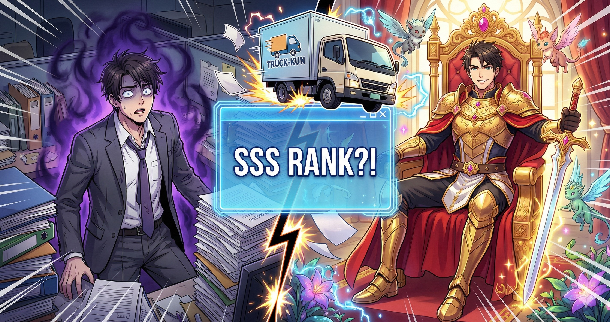

# 🚚 이세계 편도 티켓 발급소 (Isekai One-Way Ticket)

> **"트럭에 치이기 전, 당신의 운명을 미리 확인하세요."**
> 사용자의 이름과 성별, 스트레스 요인을 분석하여 이세계 환생 등급, 스킬, 소환된 세계를 발급해주는 웹 서비스입니다.

🔗 **Demo Link:** [https://isekai-ticket.pages.dev](https://isekai-ticket.pages.dev) (여기에 실제 배포 주소를 넣으세요)



## 📌 프로젝트 소개
단순한 랜덤 뽑기가 아닌, 웹소설/웹툰의 클리셰를 활용한 엔터테인먼트 웹 앱입니다.
사용자에게 몰입감을 주기 위해 **모바일 자이로 센서(Gyroscope)**를 활용한 홀로그램 효과와 **다국어(i18n)** 기능을 구현했습니다.

## 🛠️ 기술 스택 (Tech Stack)
- **Core:** HTML5, CSS3, Vanilla JavaScript (ES6+)
- **Library:** [html2canvas](https://html2canvas.hertzen.com/) (이미지 캡처 및 저장)
- **Deployment:** GitHub Actions & Cloudflare Pages
- **Design:** Responsive Web Design (Mobile First), CSS3 3D Transform

## ✨ 주요 기능 (Key Features)

### 1. 3D 홀로그램 카드 (Mobile Gyroscope)
- 스마트폰의 **자이로 센서(DeviceOrientation)**를 감지하여, 폰을 기울이는 각도에 따라 카드의 홀로그램 빛이 실시간으로 움직입니다.
- iOS(iPhone)의 보안 정책에 대응하여, 버튼 클릭 시 권한 요청(Permission Request) 로직을 구현했습니다.
- PC 환경에서는 마우스 움직임(MouseMove)에 반응하도록 인터랙션을 통합했습니다.

### 2. 보안 캡처 시스템 (Secure Capture)
- `html2canvas` 라이브러리 사용 시 `backdrop-filter` 등 최신 CSS 효과가 깨지거나, 숨겨진 히든 콘텐츠가 노출되는 문제를 해결했습니다.
- 저장 버튼 클릭 시, 찰나의 순간에 DOM을 조작하여 **보안이 필요한 정보(히든 스킬 등)를 숨기고 캡처**한 뒤 원상 복구하는 로직을 적용했습니다.

### 3. 글로벌 다국어 지원 (i18n)
- 한국어(KO), 영어(EN), 일본어(JP) 3개 국어를 지원합니다.
- `data.js` 내에 언어별 JSON 데이터를 구조화하여, 버튼 클릭 시 즉시 UI와 콘텐츠가 전환됩니다.

### 4. 시드 기반 랜덤 알고리즘 (Seeded Random)
- 단순 `Math.random()`이 아닌, 사용자의 이름과 입력값을 해시(Hash)화하여 시드(Seed)로 사용하는 알고리즘을 적용했습니다.
- 동일한 이름을 입력하면 언제나 동일한 결과가 도출되어 신뢰성을 높였습니다.

## 📂 폴더 구조 (Project Structure)
📦 isekai-ticket 
 ┣ 📂 img # 배경, 캐릭터, 아이콘 등 리소스 
 ┣ 📂 audio # 효과음 (트럭 소리, 결과음) 
 ┣ 📜 index.html # 메인 페이지
 ┣ 📜 style.css # 전체 스타일링 & 애니메이션 
 ┣ 📜 script.js # 핵심 로직 (자이로, 캡처, 랜덤 생성) 
 ┣ 📜 data.js # 언어별 데이터 (KO/EN/JP) 
 ┗ 📜 README.md # 프로젝트 문서

## 🚀 설치 및 실행 (How to Run)
이 프로젝트는 정적 웹사이트(Static Website)이므로 별도의 서버 설치가 필요 없습니다.

1. 저장소를 클론합니다.
   ```bash
   git clone [https://github.com/your-username/isekai-ticket.git](https://github.com/your-username/isekai-ticket.git)

2. index.html 파일을 브라우저에서 실행하거나, VS Code의 Live Server를 사용하세요.

## 📄 License
This project is for entertainment purposes only. Copyright © 2026 Isekai Ticket Agency. All rights reserved.
